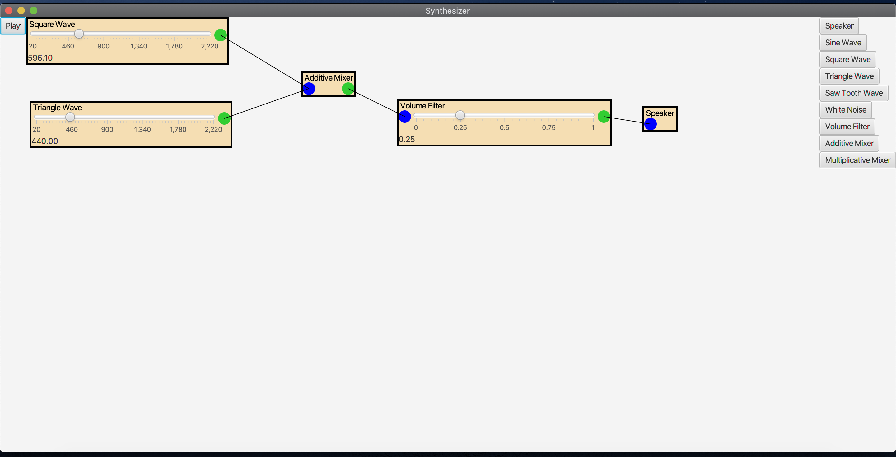

# Synthesizer
Fully functional synthesizer with an interactive GUI built in Java. Combine different frequencies to make cool sounds. Sounds were made from scratch bitwise. Heavy use of OOP and JavaFX. Requires JavaFX to run. Install here https://openjfx.io/. Tested and developed in Intellij for macOS. Should work on anything.

